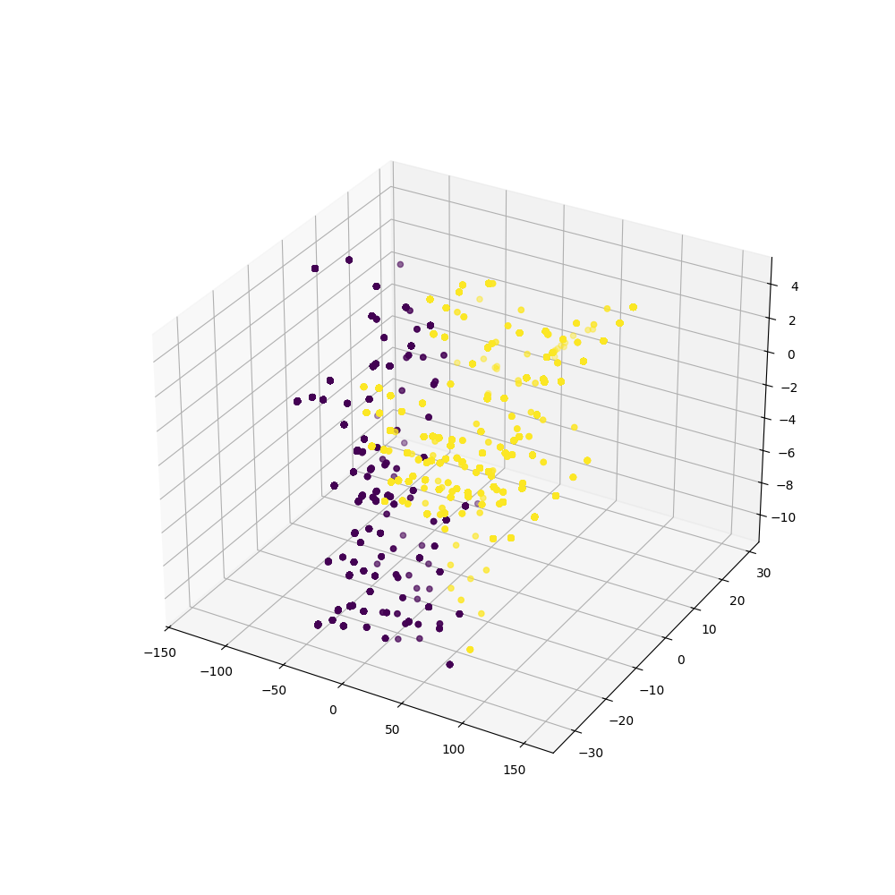
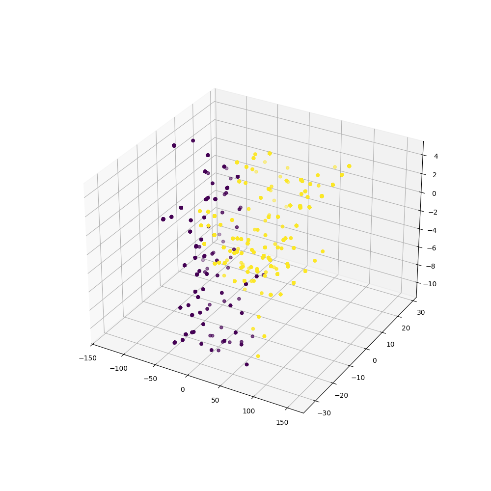
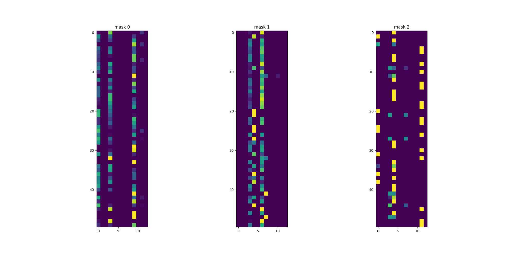

# 2024 2학기 DScover 가이드 프로젝트
2024-2  성균관대학교 데이터분석 학회 DScover 가이드 프로젝트 E조

## 인구 소득 예측 프로젝트(Adult Census Income Prediction)
데이콘에서 진행한 **인구 데이터 기반 소득 예측 AI 해커톤**을 진행하였습니다.

[대회 페이지로 이동](https://dacon.io/competitions/official/235892/overview/description)


## Quick Start
## MacOS, WindowsOS, LinuxOS

레포지토리 복제
```shell
git clone https://github.com/Skkuhodomo/DScover-adult-income-prediction
```

라이브러리 설치
```shell
pip install -r requirements.txt
```


케글에서 데이터셋을 다운로드 합니다. 그 후, './data/'위치로 이동시킵니다.

[데이터셋](https://www.kaggle.com/datasets/wenruliu/adult-income-dataset)

---

## Data Analysis
세부 내역은 `main.ipynb`을 참고하길 바란다. 

### 데이터 정의

```txt 
id : 샘플 아이디
age : 나이
workclass : 일 유형
fnlwgt : CPS(Current Population Survey) 가중치
education : 교육수준
education.num : 교육수준 번호
marital.status : 결혼 상태
occupation : 직업
relationship : 가족관계
race : 인종
sex : 성별
capital.gain : 자본 이익
capital.loss : 자본 손실
hours.per.week : 주당 근무시간
native.country : 본 국적
target : 소득 
```
---

## Model 
###  LightGBM 
Tree  구조를 기반으로 한 gradient boosting framework이다. Leaf-wise (Best-first) Tree Growth 구조를 택하기 때문에 Level-wise Tree Growth 구조를 사용하는 XGBoost보다 빠른 속도로 학습할 수 있다. 


###  TabNet 
본 프로젝트의 진행 과정에서 주관이 반영된 Feature Engineering의 한계를 느껴, Attention-layer를 사용한 딥러닝 모델인 TabNet을 통한 임베딩을 진행, 그 후 분석을 진행하였다. 해당 코드는 `tabnet_embedding.ipynb`를 참고하면 된다. 


위 그림은 TabeNet의 구조를 나타낸다. 

결과적으로 딥러닝을 통한 개선을 크게 보지 못하였다. 그 이유는, 데이터가 25000개로 비교적 적다는 점, 데이터 자체의 이상치가 존재할 가능성을 배제하지 못하기 때문이다. 

$$
\text{cosine similarity} = \frac{A \cdot B}{\|A\| \|B\|}
$$


정확도가 떨어지는 원인 분석을 위해 (데이터 누수에 해당하지만) 임베딩 후 코사인 유사도를 기반으로 train과 test의 유사한 행들을 그룹화하였다. 그 결과 범주형 열의 차이가 income의 결과를 다르게 만드는 경우, 즉 다른 데이터는 모두 동일한 경우, 범주형의 차이가 실제 값과 다르게 예측하게 하는 원인으로 파악하였다. 

## Insight
본 프로젝트를 통하여 다음과 같은 인사이트를 도출할 수 있었다. 


<details>
  <summary>딥러닝을 통한 인사이트  </summary>

  # 딥러닝을 통한 인사이트 도출 
정형데이터를 위한 딥러닝 모델인 TabNet을 활용하여 몇가지 인사이트를 얻을 수 있다. 

### 1. Unspuervised Learning of TabNet

(1) 임베딩을 통한 인코딩 한계점 분석 (사후 분석)
유사하지만 결과가 다른 행이 다소 발견되었다.(약 300개) 이 데이터가 정확도를 낮추었을 것으로 예상한다. 
임베딩된 벡터값을 기반으로 Cosine Similarity 행끼리 묶어서 관찰 

---

결과 예시: 

test data의 3번과 train의 207번 행의 유사도가 상당히 높게 측정되었으나, income 결과가 다름

```age               27
workclass          6
education         14
education.num     15
marital.status     4
occupation         9
relationship       1
race               4
sex                1
capital.gain       0
capital.loss       0
hours.per.week    70
native.country    38
income             0
```

```
age               35
workclass          2
education         14
education.num     15
marital.status     4
occupation         9
relationship       1
race               1
sex                1
capital.gain       0
capital.loss       0
hours.per.week    40
native.country    17
income             1
```

→ hours.per.week(연속형), work.class(범주형), native.country(범주형), race(범주형)에서의 차이가 두드러지게 보임. 

이에 따라 인코딩을 단순히 **원-핫 인코딩**이 아닌, 적절한 근거를 보충하여 인코딩을 시도해볼 필요가 있음을 알 수 있다.
(2) 임베딩을 통한 클러스터링(PCA, GMM 클러스터링)
다음은 train 데이터의 임베딩 후 클러스터링 결과이다. 

3차원으로 PCA 진행 후 클러스터한 결과 명확히 분리되는 것을 확인할 수 있으며, 클러스터에 0과 1 타켓 비율이 (15:1), (3:1)인 것으로 보아 적절히 인코더가 학습되어 분리할 수 있었다고 할  수 있다. 


마찬 가지로 test에 대해서도 진행한 결과이다. 클러스터의 0과 1 비율이 (20:1), (2:1)로 train과 유사하게 분리되었다. 
train과 test 모두 유사한 클러스터링 결과를 가지고 있다. 그러나 
이제 우리가 주목해야할 것은 결과적으로 예측에 실패하는 값이 존재한다는 것이다. 

우리 조는 따라서 각 클러스터 별로 ligtGBM 학습을 진행시켰다. (`tabnet_encoding.ipynb`참고)
cluster 0 끼리의 학습 결과는 96%, cluster 1끼리의 학습 결과는 83%이다.  cluster 1은 비교적 1이 많은데, 예측 결과의 하락으로 미루어보아, 현재 우리의 모델이 0,1 데이터 불균형 또는 데이터 예측 근거 자체가 부족하여 예측에 실패하고 있음을 예측할 수 있다. 


### 2. Supervised Learning of TabNet 
TahNet의 장점은 설명 가능한 딥러닝 모델이라는 점이다. 
플 전체에 대해 어떤 변수들이 중요한지에 대한 Mask를 시각화하면 아래 그림과 같다.(아래는 50개 행에 대해 중요한 영향을 끼친 열을 찾아낸 것이다.)


위와 같이 6번 열, 3번열,등등 특정 열에 Attention하여 예측하는 것을 살필 수 있다. 
이 결과를 미루어 보아, 연속형 데이터 또는 복잡도가 높은 범주형 데이터에 대해서 재범주화하여, 복잡도를 낮출 필요성이 확인되었다. 

### 3. 개선 방안
단순히 SMOTE와 같은 오버샘플링 방식은 오히려 정형 데이터를 이용한 부정확한 샘플 제공으로 부정적인 영향을 줄 수 있다. 
따라서 **CTGAN**과 같은 모델은 응용하여 데이터를 증폭시킬 필요성이 있다. 

또한 임베딩과 클러스터링 결과로 미루어 보아, 현재 데이터는 소득 예측을 위해서는 다소 부족하거나 부정확할 가능성이 존재한다. 따라서 새로운 데이터, 빈부격차, 소득격차 등의 불평등 요소 등이 반영되어 조금 더 현실적이 데이터셋으로 개선될 필요가 있다. 
---
  
</details>

## Contributors

| 이름 | 전공 | 깃허브 주소 |
| --- |--|  --- |
| 박호진(**팀장**) |시스템경영공학/데이터사이언스융합학과| |
| 심세윤 |문헌정보학/소프트웨어학| |
| 한석호 |시스템경영공학/차세대반도체공학 | |
